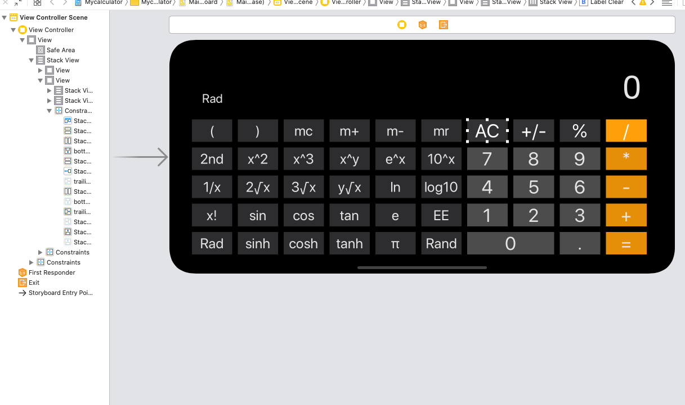
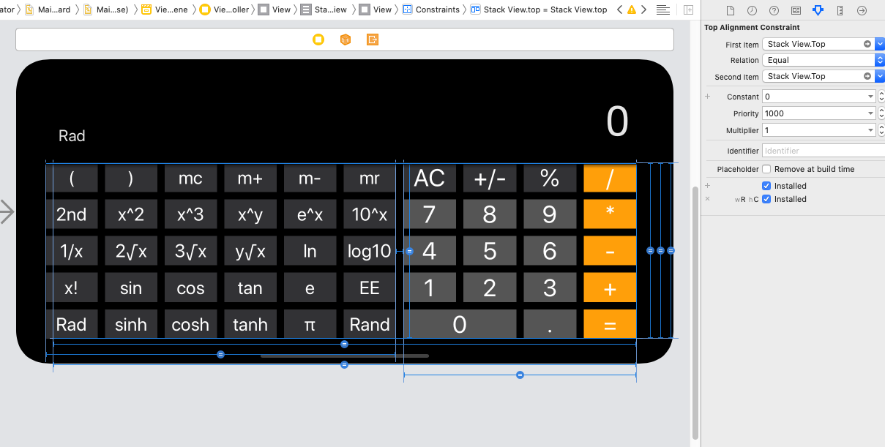

# ios开发作业一 计算器开发

|  姓名  |   学号    |       邮箱        |
| :----: | :-------: | :---------------: |
| 吕玉龙 | 191220076 | 1931015836@qq.com |

本次工程仿照Apple官方的计算器实现了一个自己的计算器app，支持横屏和竖屏两种使用模型，以及所有按键的单步计算功能（除了左括号和右括号没有处理）。这个自行实现的计算器为了保证在竖屏的情况下，能显示计算结果而不超出label，故对于输入和输出的数字的长度有要求，输入不会超过1e10（以及对于小数的有效位数也有着相应的要求），同时输出结果大于1e10则会使用科学计数法来表示。该计算器唯一不尽如人意的地方在于对于三角函数的计算，对于某些数字没法得到非常精确的结果，原因在于使用数学库函数时，对于Π的使用有精度误差，所以对于边缘情况会有误差。


### 目录

+ Part one UI界面开发
+ Part two 计算功能的实现


### Part one UI界面

在实践视频的帮助下，很容完成对于竖屏的UI设计，唯一麻烦的地方在于横屏显示出不同的UI.



这里我是用了两个stackview来分别组织左边六列按钮以及只在竖屏显示的按钮，同时也为他们分别设置了constraints，同时对这些constraints进行了分别设置，即使用右侧两个小的蓝色的勾进行控制，从而达到只在竖屏或者横屏有效的设置。通过对于这些constraints的设置就实现横屏以及竖屏不同的UI界面了。对于圆角的设置则使用了keypath进行处理即可。



UI界面设置好了之后，将一些必要的UIButton和UILabel链接到viewcontroller中，以实现对按键的反应。例如对于“2nd”的控制就仿照helloworld的视频中演示的一样，利用UIButton的setTitle函数达到对于按钮字样的切换。


### Part two 计算功能实现

对于计算功能的实现，我参考了实践视频的一些框架。对于“123456789.”这十个button都绑定Numbertouched函数，剩下的按键均绑定Operationtouched函数（除了clear，2nd）。同时沿用了实践视频的digitondisplay，但是新建了一些限制（因为对于输入的长度有限制以及添加了小数点的处理，以及计算超界的处理）对于numbertouched也进行了更改。

```swift
var digitOndisplay: String{
        get{
            return self.display.text!
            
        }
        
        set{
            if(displaylength <= 9){
                displaylength += 1
                self.display.text! = newValue
                print(displaylength)
                print("get a new value")
            }
            //print(digitOndisplay)
        }
    }
```


```swift
var preciseNum:Decimal = 0

    @IBAction func NumberTouched(_ sender: UIButton) {
        if intypingmode{
            
            if doubledot == false && sender.currentTitle! == "."{
            }
            else{
                digitOndisplay = digitOndisplay + sender.currentTitle!
                preciseNum = Decimal.init(string:digitOndisplay)!
                print(preciseNum)
            }
            if sender.currentTitle! == "."{
                doubledot = false
            }
        }
        else{
            if sender.currentTitle! == "."{
            }
            else{
                if digitOndisplay == "fault"{
                    digitOndisplay = "0"
                    displaylength = 0
                    preciseNum = Decimal(0)
                }
                digitOndisplay = sender.currentTitle!
                preciseNum = Decimal.init(string:digitOndisplay)!
                intypingmode = true
                label_Clear.setTitle("C", for: .normal)
            }
        }
    }
```

需要注意的是在set方法中使用了变量来处理，故在完成clear按钮对应的函数时，要非常注意对于digitondisplay的清零以及对于displaylength的清零，否则下次输入时，可能就不能输入10个数字了。同时在这里先声名以下，由于浮点数计算本身就有误差，故使用double类型将会带来不精确的结果，所以这里我全部使用Decimal类型，这样可以计算出准确的结果，不会产生大量误差，不过Decimal类型转String和Double类型则相对麻烦，以及使用科学计数法输出时，也有些麻烦。同时由于我会display一些舍入过的结果，故再用label上的text进行计算将不会得到准确的结果，故使用precisenumber来进行准确计算。下面则是对于科学计数法输出的展示。

```swift
if result.exponent < -8{
             let number:NSNumber = NSNumber(value: NSDecimalNumber(decimal: result).doublevalue)
             print(number)
             let numberformat = NumberFormatter()
             numberformat.numberStyle = .scientific
             numberformat.maximumSignificantDigits = 8
             print("bad")
                                
             let string1 = numberformat.string(from: number)!
            
             print("time \(string1)")
             displaylength = 0
             digitOndisplay = string1
             print("numberstring : \(numberformat.string(from: number)!)")
                                
}
```

对于calculator类，沿用了时间视频的框架，采用enum和字典来区分二元操作符和一元操作符。不过对于BinaryOp以及UnaryOp两个函数则可以返回空类型。原因在于有些计算是有定义域限制，如果没法计算或者结果超界，则返回nil，然后在Operationtouched函数中使用if let函数，对于超界的结果，让label显示fault即可。增加MemoryOp来处理m+等符号。

```swift
enum Operation{
        case UnaryOp((Decimal)->Decimal?)
        case BinaryOp((Decimal,Decimal)->Decimal?)
        case EqualOp
        case MemoryOp((Decimal,Decimal)->Decimal?)
    }
```

下面则是对一个有定义域限制的运算符函数（闭包）的实现

```swift
"y√x":Operation.BinaryOp{
           (op1,op2) in
            return ((op1 >= 0 || (op1 < 0 && op2.exponent >= 0 && (op2/2).exponent == -1)) ? 				 Decimal.init((op1.isSignMinus ? -1 : 1)*pow(NSDecimalNumber(decimal: (op1.isSignMinus ? -1 : 1)*op1).doubleValue,NSDecimalNumber(decimal:1/op2).doubleValue)) : nil)
        },
```

对于操作符是等于号的情形，则需要添加特殊处理，因为需要对于连按等于号，计算器可以正常计算

```swift
case Operation.EqualOp:
                    if middleres != nil{
                    var res:Decimal? =  middleres!.newOperation(middleres!.firstop,operand)
                    var res1:Decimal? =  middleres!.newOperation(operand,middleres!.firstop)
                    if middleres?.lastPressedOp != "="{
                        middleres!.firstop = operand
                        middleres!.lastPressedOp = operation
                    }
                    else{
                        print(middleres!.firstop)
                        print(operand)
                        print("res=")
                        print(res)
                        if middleres!.newOp == "/" || middleres!.newOp == "x^y" || middleres!.newOp == "y√x" 							|| middleres!.newOp == "EE" || middleres!.newOp == "y^x" || middleres!.newOp == 							"logy"{
                            res = res1
                        }
                        else if middleres!.newOp == "-"{
                            res = 0 - res!
                        }
                    }
                    print(res)
                    print(1)
                    return res
                    }
                    else{
                        return operand
                    }
                
```

对于m+这四个操作符的处理则在类中添加一个Memorynum变量，即可进行处理了。角度转弧度则是让Operationtouched进行传入一个bool型变量来进行判断当前是角度还是弧度即可。

演示效果如下

<video src="屏幕录制2021-10-10 上午2.26.03.mov"></video>
